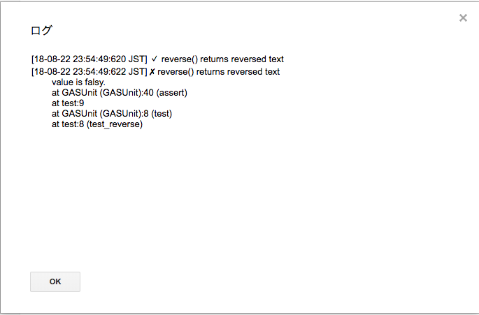
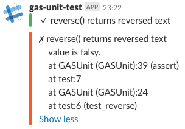

[](https://standardjs.com)

# GASUnit
Testing library for Google Apps Script.
Result will be logged to Logger, or posted to Slack.

## Usage
### Add library
project key: `MSnMmw8hLWgjUG6uKSTQBEzVZgzu5bsVr`

### Use Logger
```js
function reverse (text) {
  return text.split('').reverse().join('')
}
```

```js
var test = GASUnit.test
var assert = GASUnit.assert
  
function test_reverse () {
  test('reverse() returns reversed text', function () {
    assert(reverse('Hello') === 'olleH')
  })

  test('reverse() returns reversed text', function () {
    assert(reverse('Hello') === 'Hello')
  })
}
```

#### Result


### Use Slack
```js
function reverse (text) {
  return text.split('').reverse().join('')
}
```

```js
var test = GASUnit.slack('https://...')
var assert = GASUnit.assert

function test_reverse () {
  test('reverse() returns reversed text', function () {
    assert(reverse('Hello') === 'olleH')
  })

  test('reverse() returns reversed text', function () {
    assert(reverse('Hello') === 'Hello')
  })
}
```

#### Result

